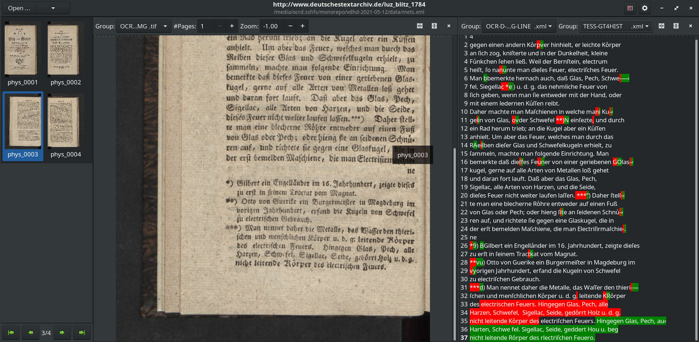

# Demos OCR-D

## Demo 0 - install ocrd_all or `ocrd/all`

> Install OCR-D locally

### Read https://ocr-d.de/en/setup guide

### Decide for native or Docker installation

### Install (native)

    git clone https://github.com/OCR-D/ocrd_all
    cd ocrd_all
    sudo make deps-ubuntu
    make all
    . venv/bin/activate

### Install (Docker)

    docker pull ocrd/all:maximum
    # or:
    docker pull ocrd/all:maximum-cuda
    mkdir -p models data
    docker run --rm -it -V $PWD/data:/data -V $PWD/models:/usr/local/share/ocrd-resources \
        ocrd/all bash

(Or, to share models between native and Docker, mount `$HOME/.local/share/ocrd-resources`.)

### Download models

    ocrd resmgr list-available
    ocrd resmgr download ocrd-tesserocr-recognize deu.traineddata
    ocrd resmgr download ocrd-tesserocr-recognize Fraktur_GT4HistOCR.traineddata
    ocrd resmgr download ocrd-calamari-recognize qurator-gt4histocr-1.0

## Demo 1 - create workspace, run Tesseract

> Start with a bunch of images, create workspace, run tesseract

### Browse IA

→ https://archive.org/details/2917685.0001.001.umich.edu/page/2/mode/2up

### Copy link for "SINGLE PAGE PROCESSED TIFF ZIP"

### Download

```sh
wget 'https://archive.org/download/2917685.0001.001.umich.edu/2917685.0001.001.umich.edu_tif.zip'
```

### Unzip and chdir

    unzip 2917685.0001.001.umich.edu_tif.zip

### Import images into new workspace

    ocrd-import -i -P . 

### Minimalist workflow

    ocrd process "tesserocr-recognize -I OCR-D-IMG -O OCR-D-OCR-TESS -P segmentation_level region -P textequiv_level word -P find_tables true -P model deu"
    # or equivalently:
    ocrd-tesserocr-recognize -I OCR-D-IMG -O OCR-D-OCR-TESS -P segmentation_level region -P textequiv_level word -P find_tables true -P model deu

The results are in the `OCR-D-OCR-TESS` file group / folder.

### Inspect results with browse-ocrd and JPageViewer

> Visualize results with [browse-ocrd](https://github.com/hnesk/browse-ocrd/) and [PRImA PageViewer](https://github.com/PRImA-Research-Lab/prima-page-viewer)


## Demo 2 - clone workspace, more complex workflow

> Start with a METS from SBB, run a more complex workflow on it

### Browse to https://digital.staatsbibliothek-berlin.de/werkansicht?PPN=PPN680203753

### Select the METS XML from the "Vollständige Bibliografische Informationen"

→ https://content.staatsbibliothek-berlin.de/dc/PPN680203753.mets.xml

### Clone the workspace

```sh
ocrd workspace clone https://content.staatsbibliothek-berlin.de/dc/PPN680203753.mets.xml
```

### Inspect available file groups

```sh
ocrd workspace find -k fileGrp -k url -k mimetype
```

### Download all images in DEFAULT file group

```sh
ocrd workspace find --file-grp DEFAULT --download
```

### Run the second workflow example from the Workflow Guide

Since our file group is called `DEFAULT`, `OCR-D-IMG` must be replaced with `DEFAULT` here.

```sh
ocrd process \
  "cis-ocropy-binarize -I DEFAULT -O OCR-D-BIN" \
  "anybaseocr-crop -I OCR-D-BIN -O OCR-D-CROP" \
  "skimage-binarize -I OCR-D-CROP -O OCR-D-BIN2 -P method li" \
  "skimage-denoise -I OCR-D-BIN2 -O OCR-D-BIN-DENOISE -P level-of-operation page" \
  "tesserocr-deskew -I OCR-D-BIN-DENOISE -O OCR-D-BIN-DENOISE-DESKEW -P operation_level page" \
  "cis-ocropy-segment -I OCR-D-BIN-DENOISE-DESKEW -O OCR-D-SEG -P level-of-operation page" \
  "cis-ocropy-dewarp -I OCR-D-SEG -O OCR-D-SEG-LINE-RESEG-DEWARP" \
  "calamari-recognize -I OCR-D-SEG-LINE-RESEG-DEWARP -O OCR-D-OCR -P checkpoint_dir qurator-gt4histocr-1.0"
```

The results are in the `OCR-D-OCR` file group / folder.

## Demo 3 - run various OCR engines on GT and evaluate

> Download GT, process with calamari, evaluate with dinglehopper and ocrd-cor-asv-ann-evaluate

**NOTE** This demo is just to show how to do the evaluation. The choice of OCR
engines, evaluation processors and models is entirely arbitrary and should not
be seen as recommendation.

### Browse to and download from OCR-D GT Repo

* Go to https://ocr-d.de/gt-repo
* Copy link to https://ocr-d-repo.scc.kit.edu/api/v1/dataresources/dda89351-7596-46eb-9736-593a5e9593d3/data/luz_blitz_1784.ocrd.zip

```sh
wget https://ocr-d-repo.scc.kit.edu/api/v1/dataresources/dda89351-7596-46eb-9736-593a5e9593d3/data/luz_blitz_1784.ocrd.zip
```

### Extract the OCRD-ZIP

Extract the `data` subdirectory of the ZIP (which contains the workspace)

```sh
unzip luz_blitz_1784.ocrd.zip 'data/*'
```

### Run small workflows for OCR results with Tesseract and Calamari, compare output

This workflow uses `ocrd-olena-binarize` (with the `sauvola-ms-split`
algorithm) to binarize the images. The images are processed by two runs with
Tesseract (using `Fraktur_GT4HistOCR` and `deu`) and one run with calamari (using `qurator-gt4histocr-1.0`).

```sh
ocrd process -m data/mets.xml \
  "olena-binarize -I OCR-D-GT-SEG-LINE -O BIN" \
  "tesserocr-recognize -P segmentation_level word -P textequiv_level line -P find_tables true -P model Fraktur_GT4HistOCR -I BIN -O TESS-GT4HIST" \
  "tesserocr-recognize -P segmentation_level word -P textequiv_level line -P find_tables true -P model deu -I BIN -O TESS-DEU" \
  "calamari-recognize -P checkpoint_dir qurator-gt4histocr-1.0 -I BIN -O CALA-GT4HIST"
```

This allows us to compare the files in `TESS-GT4HIST`, `TESS-DEU` and
`CALA-GT4HIST` with each other and with the GT in `OCR-D-GT-SEG-LINE`.

### Compare all the OCR results with the GT using `ocrd-cor-asv-ann-evaluate`

```sh
ocrd-cor-asv-ann-evaluate -m data/mets.xml -I OCR-D-GT-SEG-LINE,TESS-GT4HIST,TESS-DEU,CALA-GT4HIST -O EVAL-ASV -P confusion 20 -P metric Levenshtein
```

The results are JSON files in the `EVAL-ASV` filegroup with line-by-line distance measures between all the engine.

[`data/EVAL-ASV/EVAL-ASV.json`](https://github.com/bertsky/ocrd-demo-2021-05-12/tree/master/demo3/data/EVAL-ASV/EVAL-ASV.json) contains the metrics (CER mean and variance) and top confusion table for the full workspace:

```json
{
  "OCR-D-GT-SEG-LINE,TESS-GT4HIST": {
    "length": 110,
    "distance-mean": 0.0368893299998711,
    "distance-varia": 0.011348232597131346,
    "confusion": "([(20, ('\u2e17', '-')), (6, (0, '*')), (6, (0, ' ')), (5, ('\u017f', 's')), (4, (0, '-')), (4, (0, 'i')), (4, (0, 'e')), (3, ('\u2014', '-')), (3, (0, '.')), (3, (0, 'r')), (2, ('u', 'l')), (2, ('R', 'K')), (2, (0, '\u017f')), (2, (0, 'c')), (2, ('\u2e17', ' ')), (2, (' ', 0)), (1, ('\u201c', 0)), (1, ('t', 'r')), (1, ('.', '-')), (1, ('3', 0))], 4425)"
  },
  "OCR-D-GT-SEG-LINE,TESS-DEU": {
    "length": 110,
    "distance-mean": 0.17129872156596126,
    "distance-varia": 0.03381635236354291,
    "confusion": "([(100, ('f', '\u017f')), (16, (' ', 0)), (15, (',', '.')), (11, ('\u00fc', 'u\u0364')), (10, ('\u00f6', 'o\u0364')), (10, ('f', 0)), (9, ('b', 'd')), (9, ('\u00e4', 'a\u0364')), (9, ('s', '-')), (9, (0, '-')), (8, ('S', 'G')), (8, ('f', 'k')), (7, ('r', 't')), (7, (0, ' ')), (6, ('(', '\u017f')), (6, ('u', 'u\u0364')), (6, ('b', 'h')), (5, (0, '\u017f')), (5, ('M', 0)), (5, (0, 'z'))], 4510)"
  },
  "OCR-D-GT-SEG-LINE,CALA-GT4HIST": {
    "length": 110,
    "distance-mean": 0.05106674581570344,
    "distance-varia": 0.01795657646161947,
    "confusion": "([(20, ('\u2e17', '-')), (17, (0, 'e')), (12, (0, '*')), (11, (0, ' ')), (8, (0, 'l')), (7, (0, 'c')), (7, (0, 'r')), (6, ('e', 'c')), (6, (' ', 0)), (6, (0, 'd')), (5, (0, ',')), (5, (0, 'h')), (5, (0, 'i')), (5, (0, 'n')), (4, ('.', '-')), (4, ('\u017f', 's')), (4, (0, '-')), (4, (0, 'u')), (3, (0, 'S')), (3, (0, 'a'))], 4429)"
  }
}
```

[`data/EVAL-ASV/EVAL-ASV_0003.json`](https://github.com/bertsky/ocrd-demo-2021-05-12/tree/master/demo3/data/EVAL-ASV/EVAL-ASV_0003.json) contains the metrics for each line of page 3.

### Compare Calamari output with GT using `ocrd-dinglehopper`

```sh
ocrd-dinglehopper -m data/mets.xml -P textequiv_level line -I OCR-D-GT-SEG-LINE,CALA-GT4HIST -O EVAL-DINGLE
```

The result are HTML files (Diff View) and JSON files (with CER and WER).

[HTML](https://github.com/bertsky/ocrd-demo-2021-05-12/tree/master/demo3/data/EVAL-DINGLE/EVAL-DINGLE_0003.html) for page 3:

[](https://github.com/bertsky/ocrd-demo-2021-05-12/tree/master/demo3/data/EVAL-DINGLE/EVAL-DINGLE_0003.json)

[JSON](https://github.com/bertsky/ocrd-demo-2021-05-12/tree/master/demo3/data/EVAL-DINGLE/EVAL-DINGLE_0003.json) for page 3:

```json
{
    "gt": "OCR-D-GT-SEG-LINE/OCR-D-GT-SEG-LINE_0003.xml",
    "ocr": "CALA-GT4HIST/CALA-GT4HIST_0003.xml",

    "cer": 0.07770472205618649,
    "wer": 0.1320754716981132,

    "n_characters": 1673,
    "n_words": 265
}
```

### Visualize with browse-ocrd

> Show diff view in browse-ocrd (https://github.com/hnesk/browse-ocrd/tree/diff-view)



    browse-ocrd data/mets.xml

## Demo 4 - makefiles

> Recreate demo1 and demo2 via equivalent makefiles

### Try to build

    make -f demo1.mk demo1
    make -f demo2.mk demo2

> make[1]: Entering directory 'demo1'
> make[1]: 'OCR-D-OCR-TESS' is up to date.
> make[1]: Leaving directory 'demo1'
> make[1]: Entering directory 'demo2'
> make[1]: 'OCR-D-OCR is up to date.
> make[1]: Leaving directory 'demo2'

### Trigger rebuild

    touch demo1/OCR-D-IMG demo2/DEFAULT
    make -f demo1.mk demo1
    make -f demo2.mk demo2

